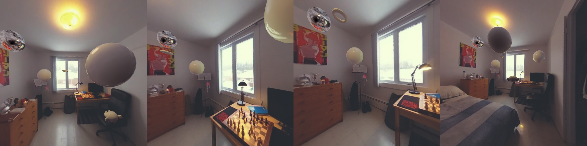
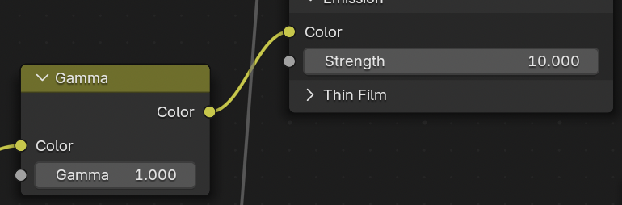
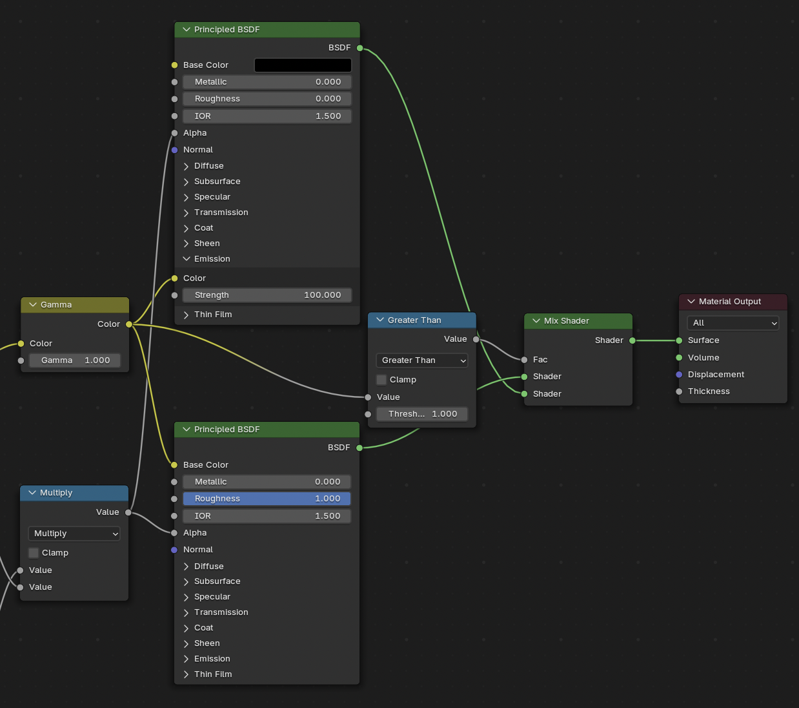
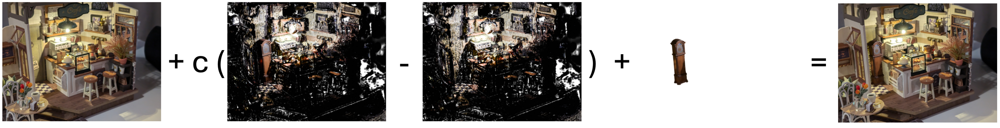

<div align="center">
<h1>GaSLight: Gaussian Splats for Spatially-Varying Lighting in HDR</h1>

[**Christophe Bolduc**](https://christophebolduc.ca/) · [**Yannick Hold-Geoffroy**](https://yannickhold.com) · [**Zhixin Shu**](https://zhixinshu.github.io) · [**Jean-François Lalonde**](http://www.jflalonde.ca/) 


<a href="https://arxiv.org/abs/2504.10809"></a>
<a href='https://lvsn.github.io/gaslight/'></a>
</div>




## Environments

1. Clone the repo and submodules
```bash
git clone --recursive https://github.com/lvsn/gaslight.git
```

2. Create the conda environment. Assuming CUDA 12.4, need modifications for other versions.
```bash
conda env create --file environment.yml
conda activate gaslight
```

## Pre-trained Weights

As the original model was trained using closed data, we provide weights trained on three open-source datasets: [Polyhaven](https://polyhaven.com/), [Laval Photometric Indoor HDR](http://hdrdb.com/indoor-hdr-photometric/) and [Laval Outdoor HDR](http://hdrdb.com/outdoor/)

The following table compares the scores of the provided weights in comparaison to the closed weights on the Si-HDR dataset.

| Method | MSE↓ | PSNR↑ | Ang err↓ |
|:-|-:|:-:| :-:|
| LDR | 0.0715 | 13.0605 | 2.7728 |
| HDRCNN | 0.0246 | 23.6138 | 2.5862 |
| MaskHDR | 0.0243 | 23.5503 | 2.5224 |
| SingleHDR | 0.0178 | 24.0680 | 3.3228 |
| ExpandNet | 0.0187 | 24.7158 | 2.0958 |
| Exposure Diff | 0.0264 | 23.7384 | 2.5183 |
| Ours (paper) | 0.0131 | 25.3895 | 2.1721 |
| [Ours (public)](https://hdrdb-public.s3.valeria.science/gaslight/gaslight_weights.ckpt) | 0.0163 | 24.9968 | 2.2447 |

The [weights](https://hdrdb-public.s3.valeria.science/gaslight/gaslight_weights.ckpt) should be moved to the `HDR_reconstruction/checkpoints` directory.

## HDR Reconstruction

The following command, ran in the `HDR_reconstruction` directory, will run the inference of HDR prediction from a given LDR image
```bash
python makeHDR.py --image <path/to/LDR/image> --out_dir <path/to/ouput> --ckpt_path checkpoints/gaslight_weights.ckpt --save_stacks
```

Alternatively, the argument `image` can be replaced with `images_dir` to batch process images.
For example, the following command will predict the HDR for every images of the example provided.
```bash
python makeHDR.py --images_dir ../3DGS/example/hall/images --out_dir ../3DGS/example/hall/hdr --ckpt_path checkpoints/gaslight_weights.ckpt --save_stacks
```

By default, only negative EVs will be predicted until no more pixel are saturated (up to a minimum of EV-12). However, the flag `predict_ev_plus` can be set to also predict positive EVs 2 and 4.
```bash
python makeHDR.py --predict_ev_plus --images_dir ../3DGS/example/hall/images --out_dir ../3DGS/example/hall/hdr --ckpt_path checkpoints/gaslight_weights.ckpt --save_stacks
```

### Evalutation Datasets

- SI-HDR: We share our reconstructions for the clip_95 images of the [SI-HDR dataset](https://www.repository.cam.ac.uk/items/c02ccdde-db20-4acd-8941-7816ef6b7dc7) using our gaslight method [here](https://hdrdb-public.s3.valeria.science/gaslight/si-hdr_gaslight.tar.gz). We found some HDR images to be saturated [list](assets/saturated_si_hdr.txt)

- BtP-HDR: We adapt the Theta Dataset from [Beyond the Pixel](https://lvsn.github.io/beyondthepixel/) to obtain a HDR dataset with `reference` HDR images, `input` LDR images directly produced by the camera and `reconstructions` from publicly available methods ([ExpandNet](https://github.com/dmarnerides/hdr-expandnet), [HDRCNN](https://github.com/gabrieleilertsen/hdrcnn), [MaskHDR](https://github.com/marcelsan/Deep-HdrReconstruction), [SingleHDR](https://github.com/alex04072000/SingleHDR)) as well as our own gaslight. The full dataset is available [here](https://hdrdb-public.s3.valeria.science/gaslight/BtP-hdr.tar.gz)

## 3D Pipeline

The HDR 3DGS pipeline can be separated into three steps

1. HDR Reconstruction of input images as detailed [before](#hdr-reconstruction) 

2. 3D camera pose estimations and HDR point cloud initialization. This step ran with the script `inference_poses_vggt.py` runs [vggt](https://github.com/facebookresearch/vggt) on the input images and use the predicted HDR images as color initialization for the resulting point cloud.

3. 3D HDR Gaussian Splatting optimization. This is ran with the script `inference_gs_HDR.py`, which runs a modified version of the #DGS optimization by keeping the gaussian colors in linear HDR space and jointly optimize the gaussian properties and camera poses.

The whole pipeline can be ran with the following command, by changing the appropriate scene.
```bash
. run.sh
```

the final gaussian model will be stored in <ROOT>/inference/<SCENE>/HDR/gaussians.ply


## Virtual Object Insertion

Now that a linear HDR 3D Gaussian Splats model has been optimized, it can be used for downstream applications. One such application is the insertion of virtual objects in the scene.
We used a [Blender Gaussian Splatting addon](https://github.com/ReshotAI/gaussian-splatting-blender-addon) to import the model and interact with the cycles ray-path renderer. Though the rendering of Gaussians is not exact, its quality is sufficient for relighting. 

To modify the rendering for HDR Gaussians, we set the Gamma of the `GaussianSplatting` material to `1` in the Shader Editor and set the strength based on the exposure of the render.


Further, to render shadows produced by inserted object, we modify the material to display as emitters when beyond a threshold and as diffuse otherwise. 


By rendering the scene from the view of an input image with and without the object and the object only, the final composite with shadows can be composited with:
composite = mask * object + (1 - mask) * (background + 0.5 * (full - empty))
$$ bg + c(withObj - withoutObj) + obj = composite$$
Where $c$ is the strength of the shadows

